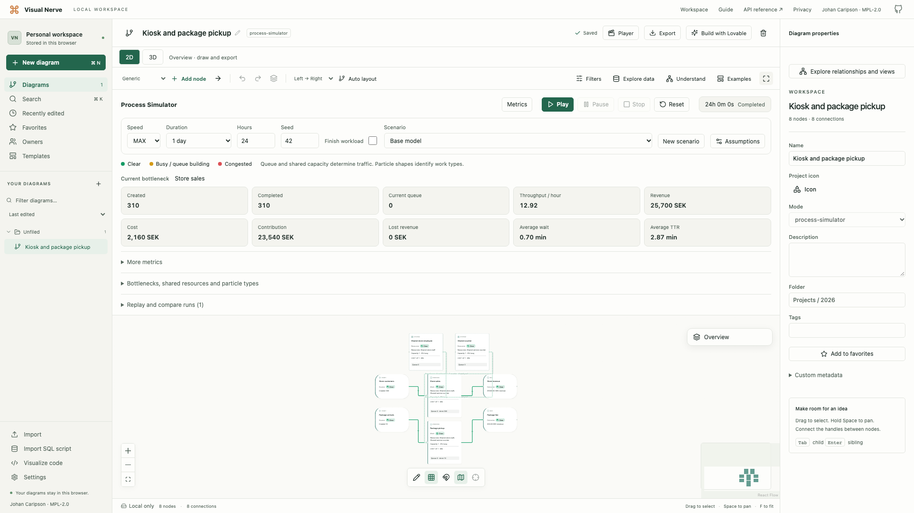

# Visual Nerve

[](https://github.com/Caripson/visualnerve/actions/workflows/ci.yml)

A local-first visual workspace for understanding what connects ideas, data, code and processes. Build a diagram, explore it in 2D or 3D, annotate the relationships and turn it into a narrated walkthrough or a reviewed app brief.

[Open Visual Nerve](https://www.visualnerve.com/app/) · [User guide](https://www.visualnerve.com/help/) · [Website](https://www.visualnerve.com/) · [API reference](https://www.visualnerve.com/api/docs/)

The [source repository](https://github.com/Caripson/visualnerve) and [issue forms](https://github.com/Caripson/visualnerve/issues/new/choose) are public. [Staging](https://visualnerve.caripson.com/) remains a separate review environment with its own browser workspace.

<picture>
  <source media="(prefers-color-scheme: dark)" srcset="hugo/static/site/images/desktop-dark.webp">
  <source media="(prefers-color-scheme: light)" srcset="hugo/static/site/images/desktop.webp">
  
</picture>

The screenshot shows the actual desktop workspace with illustrative data. Light and dark versions follow your viewing preference.

## What you can do

| Workflow | Capabilities |
| --- | --- |
| Map a system | Mind maps, flowcharts, timelines, groups, directed relationships, owners, status and a saved pen layer. |
| Inspect large diagrams | Semantic overview, relationship questions, source evidence, saved analysis views and named local history. |
| Explore data | Worker-based CSV cleanup, filters, grouping and aggregates; connect and refresh sources while retaining annotations. |
| Understand code | Visualize SQL SELECT/WITH and DDL, analyze 50 code languages plus Markdown, or inspect a ZIP project by file, declaration or folder. |
| Import existing diagrams | Preview and convert a selected draw.io or Visio `.vsdx` page into editable native objects. |
| Rotate the same diagram | Styled 3D card relief with readable front/back text and editable placement; return to the canonical 2D layout. |
| Explain and share | Numbered/storyboard walkthroughs, local English/Swedish narration, video, PNG, PDF, native vector SVG, Markdown and lossless JSON. |
| Simulate a process | Seeded worker runs with queues, shared resources, nested processes, scenarios, metrics, economics and bounded replay archives. |
| Connect other tools | Optional local REST/MCP for the same validated model; review a workflow brief before opening it in Lovable. |

Code/SQL imports analyze structure without executing the source. Import previews report unsupported or uncertain constructs. File imports default to 50 MiB; larger configured imports are experimental. ZIP projects default to 500 analyzed source files, with a separate browser-local setting up to 10,000. See the [import guides](docs/CODE_IMPORT.md) for the byte, count and time limits.

## Your data stays in your browser

The editor stores diagrams, CSV sources, saved history and simulation archives in IndexedDB. No account or cloud database is required. Accept local browser storage and offline app caching before opening the workspace. After an initial accepted online visit, the cached editor can reload and save offline.

Each browser profile and exact origin owns a separate workspace: `localhost` and `127.0.0.1`, or staging and another host, do not share data. Clearing or losing browser storage can remove your work. Use **Settings → Data & Privacy → Export all data** regularly and before changing browser, device or origin; restore that backup at the destination. Per-diagram JSON is lossless for the current graph, while full backups also retain saved history and simulation archives.

Storage consent, MCP grants, credentials and the two browser-local import limits are excluded from backups. Sharing an export, an MCP response with an AI client, or a reviewed Lovable brief is an explicit action that can disclose its contents. See [privacy](docs/PRIVACY.md), [storage](docs/STORAGE.md) and [security](SECURITY.md).

## Run locally

Install **Go 1.26+**, **Node.js 22.12+**, **npm** and **Hugo 0.140+** (standard or extended). The scripts support Linux, WSL and macOS. Initial dependency installation needs internet access; cached dependencies permit subsequent offline builds.

```sh
git clone https://github.com/Caripson/visualnerve.git
cd visualnerve
./dev.sh
```

Open [http://localhost:4317/app/](http://localhost:4317/app/). The command installs missing frontend dependencies, builds React/Hugo, compiles the optional Go server and starts it. For frontend hot reload, use `./dev.sh --watch` and open [http://localhost:5173](http://localhost:5173). These addresses have separate browser workspaces.

For a static build:

```sh
./build.sh
./bin/visual-nerve --static ./public
```

`public/` is the deployable static site. Any suitable HTTPS static host can serve it; no Node, Hugo or Go toolchain is needed at runtime. The binary provides convenient local serving and an optional integration bridge. See [deployment](docs/DEPLOYMENT.md). S3/CloudFront publishing is manual through the deployment workflows; a push does not deploy the site.

## Connect REST or MCP

```sh
./dev.sh --bridge
```

Keep the intended browser workspace open and select **Settings → Codex / MCP integration → Read only** or **Read + write**; access defaults to Off. A local client uses `http://localhost:4317/mcp` or REST under `http://localhost:4317/api/v1`. The separate browser connection uses `/bridge` over WebSocket. The Go process forwards commands to the browser and stores no workspace data.

For MCP, call `visual_nerve_api_docs` before `visual_nerve_request`; the guide and OpenAPI contract are bundled. A separately hosted app may need an exact allowed origin, trusted local TLS and browser local-network permission. Read [connection setup](docs/MCP.md) and the [API contract](API.md) before configuring that connection.

## Test and contribute

```sh
./scripts/test.sh
# Install Chromium once before running the full browser suite:
(cd frontend && npx playwright install --with-deps chromium)
./scripts/test.sh --e2e
```

The first command runs Go tests/race checks/vet, frontend unit tests and formatting checks. The full suite also builds the application and runs isolated browser acceptance tests. It does not use a personal browser profile. [Development](DEVELOPMENT.md) explains focused checks, browser diagnostics, schema migrations and environment settings.

See [CONTRIBUTING.md](CONTRIBUTING.md) for the contribution workflow, [SUPPORT.md](SUPPORT.md) for questions and bug reports, [SECURITY.md](SECURITY.md) for the security boundary and reporting, and [CODE_OF_CONDUCT.md](CODE_OF_CONDUCT.md) for community expectations. Repository work follows [AGENTS.md](AGENTS.md).

For ordinary questions or private inquiries, contact [hello@visualnerve.com](mailto:hello@visualnerve.com). Use [GitHub Issues](https://github.com/Caripson/visualnerve/issues/new/choose) for public product bugs and [private vulnerability reporting](SECURITY.md#reporting-a-vulnerability) for security findings.

## Documentation

The [documentation index](docs/README.md) groups all guides and implementation
contracts. [Repository launch and maintenance](docs/REPOSITORY_READINESS.md) records the
public reporting routes and release checks.

| Start here | Reference |
| --- | --- |
| Use the workspace | [Task-oriented user help](https://www.visualnerve.com/help/) and [help maintenance](docs/HELP.md) |
| Understand the implementation | [Architecture](ARCHITECTURE.md), [data model](DATA_MODEL.md), [storage](docs/STORAGE.md), [development](DEVELOPMENT.md) |
| Integrate a client | [REST API](API.md), [MCP](docs/MCP.md), [OpenAPI](docs/openapi.yaml) |
| Analyze sources | [CSV](docs/CSV_EXPLORER.md), [connected analysis](docs/ANALYSIS_WORKFLOWS.md), [SQL](docs/SQL_IMPORT.md), [code/ZIP](docs/CODE_IMPORT.md), [draw.io/Visio](docs/DIAGRAM_IMPORT.md) |
| Explore and explain | [Understanding/history](docs/UNDERSTANDING.md), [3D](docs/SPATIAL_DIAGRAMS.md), [drawing](docs/DRAWING.md), [presentations](docs/PRESENTATION.md), [speech](docs/SPEECH.md) |
| Simulate and share | [Process Simulator](docs/PROCESS_SIMULATOR.md), [export formats](EXPORT_FORMAT.md), [Lovable handoff](docs/LOVABLE.md) |
| Operate and verify | [Deployment](docs/DEPLOYMENT.md), [website configuration](docs/WEBSITE.md), [requirements](docs/REQUIREMENTS.md), [acceptance](docs/ACCEPTANCE.md) |

## License

Created by **Johan Caripson**. Original project source and documentation use [Mozilla Public License 2.0](LICENSE); see [NOTICE](NOTICE). Third-party libraries, speech runtimes and voice models retain their own terms. [DEPENDENCIES.md](DEPENDENCIES.md) lists them; [licensing and source distribution](docs/LICENSING.md) explains distribution obligations and earlier versions.
